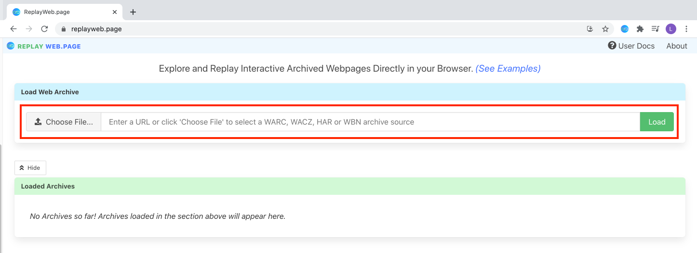

# Loading Archived Items

ReplayWeb.page can load archived items from the local filesystem, or from remote locations. If you don't have any archived items yet, try archiving a website with [ArchiveWeb.page](https://archiveweb.page)!

---

## Loading Local Files

From [replayweb.page](https://replayweb.page), press the _Choose File..._ button, pick any local archived item file from your computer, then press _Load_ to start viewing the file's archived content. 

The archived item is loaded directly in the browser and is _not_ uploaded anywhere — your data never leaves your computer!

Once loaded, the archived item will appear in the list of Loaded Archives and will be identified by its filename with a a `file://` URL as its source. This URL is not shareable as it doesn't exist outside of your computer.

## Loading Files from a URL

To load an archived item stored in a remote location, enter the URL of the file and press _Load_.

The archived item will be downloaded, either fully or on-demand (if possible) and presented when ready.

See the [Supported Locations](../../develop/locations/) page for details on supported external sources for serving archived items.

## Loading Files from Google Drive

In addition to loading remote content from URLs, ReplayWeb.page also supports loading WARC and WACZ files directly from Google Drive.

### Add-on Installation

First, install the [ReplayWeb.page Google Drive Addon](https://gsuite.google.com/u/2/marketplace/app/replaywebpage/160798412227).

* Press the _Install_ button, Google will walk you through the steps of installation.
* Once installed, Google will confirm the install and display where to find ReplayWeb.page in your drive.

<figure>
    
    <figcaption>Installing the ReplayWeb.page Google Drive add-on</figcaption>
</figure>

### Usage

1. Navigate to any WARC or WACZ files that available on your Google Drive.

2. Under the file's _More Actions_ :bootstrap-three-dots-vertical: menu, select _Open With_ and choose _ReplayWeb.page_ from the menu.

This will redirect to ReplayWeb.page and begin loading the file. Items loaded from Google Drive will have a source URL starting with `googledrive://`.

---

Once an archived item has been successfully loaded, the app will display the archive viewer and you can begin exploring your loaded archive.
